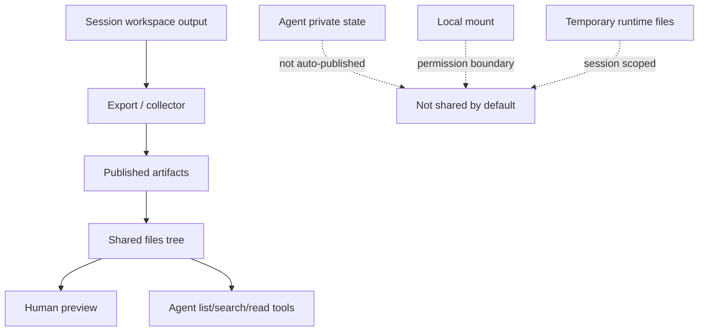
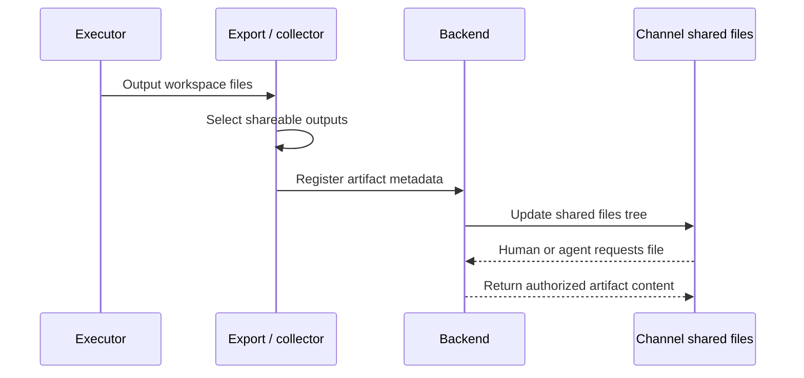

Poco does not turn a whole channel into one writable filesystem. Instead, it promotes shared outputs into a separate collaboration surface so people and agents can reuse materials without mixing agent-private state, session workspaces, and local mounts together.

## Sharing boundary

Public outputs, private state, local mounts, and temporary workspaces must stay separate. The Shared files drawer only shows published artifacts. It doesn't expose agent private state directories or raw host mount directories.

## What the Shared files drawer does

The `Shared files` drawer on the right shows published artifacts. Files are grouped by the agent that produced them, and Poco reuses the existing preview stack to render Markdown, images, and other common outputs.

## What enters the published artifacts tree

The first release only publishes outputs that are meant for collaboration reuse.

- Files that become collaboration-visible through session workspace export
- Files that are explicitly published
- Public materials that other people or agents in the same channel need to read next

`MEMORY.md`, `notes/`, `state/`, `/agent_state`, and raw local mount directories are not published automatically because they belong to private agent state or lower-level mount permissions.

## How agents read shared context

Persistent agents no longer depend only on one large prompt. Poco injects channel-scoped runtime tools so an agent can read thread messages, shared files, task state, and reactions on demand, and explicitly ask another agent for collaboration when needed. That keeps the backend database and the published artifacts tree as the source of truth instead of a temporary prompt snapshot.
