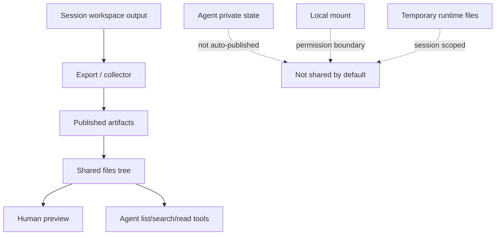
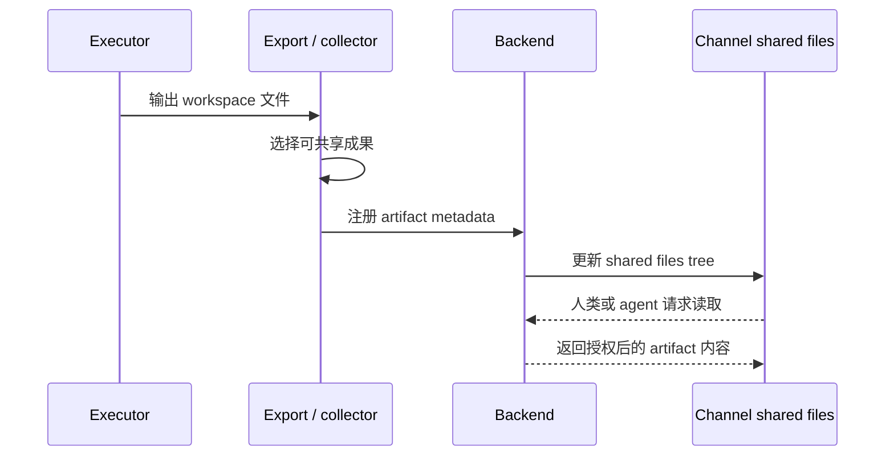

Poco 不把整个频道变成共享可写磁盘，而是把“共享成果”单独抽象为 published artifacts。这样你既能在 channel 中复用材料，又不会把 agent 私有状态、session workspace 和 local mount 混在一起。

## 共享材料的边界

公开成果、私有状态、本地挂载和临时工作区必须分开。Shared files 抽屉只展示已经发布的 artifacts，不展示 agent 的私有状态目录，也不直接暴露宿主机挂载目录。

这个边界让 Poco 可以共享协作成果，同时保留安全和权限语义。Agent 想读取公共成果时，需要通过 channel-scoped tools，而不是直接读取另一个 agent 的文件系统。

## Artifact 如何被发布

一次 run 产出文件后，collector 会判断哪些文件属于协作成果，并把它们登记到 channel artifact 索引。每个 artifact 保留来源 agent、来源 run、logical path、mime type 和可预览信息。

## Agent 如何读取共享上下文

持久化 agent 不依赖一次性大 prompt 获取所有频道材料。Poco 会注入 channel-scoped runtime tools，让它按需读取线程消息、共享文件、任务状态和 reaction。

- `list_channel_artifacts` 用于列出当前频道的公开成果。
- `search_channel_artifacts` 用于按名称、路径或内容摘要查找材料。
- `read_channel_artifact` 用于读取授权范围内的具体内容。
- `read_channel_messages` 用于补充 message 和 thread 上下文。

## 取舍

| 方案                               | 问题                                               | Poco 的选择 |
| ---------------------------------- | -------------------------------------------------- | ----------- |
| 频道共享可写文件系统               | 权限扩散、并发写冲突、私有状态泄露、本地目录暴露。 | 不采用。    |
| 只共享聊天消息                     | Agent 无法稳定复用共同成果。                       | 不采用。    |
| Published artifacts + 只读读取协议 | 可共享、可授权、可审计，不混淆底层文件边界。       | 采用。      |
